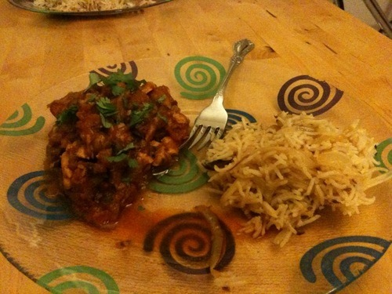

**Homestyle Salmon Curry with Indian Style Basmati Rice:**

This time I used yellow onions which made a huge difference. They brown better than white onions and are more flavorful. Also, I neglected the “salt to taste” part last time. I made sure not to miss that step this time. The salmon was seasoned with salt and pepper and seared on both sides to introduce a nice crust. It was then transferred to the curry for the remainder of the cooking time.  
  
Rice recipe is here: [allrecipes.com/recipe/indian-style-basmati-rice/Detail.aspx](http://allrecipes.com/recipe/indian-style-basmati-rice/Detail.aspx)  
  
The use of whole cinnamon sticks, cumin seeds and cardomom pods makes all the difference. Also, basmati rice cooked this way resembles the rice you eat at Indian restaurants. Firm and maintaining texture, whilst still being fully cooked.
