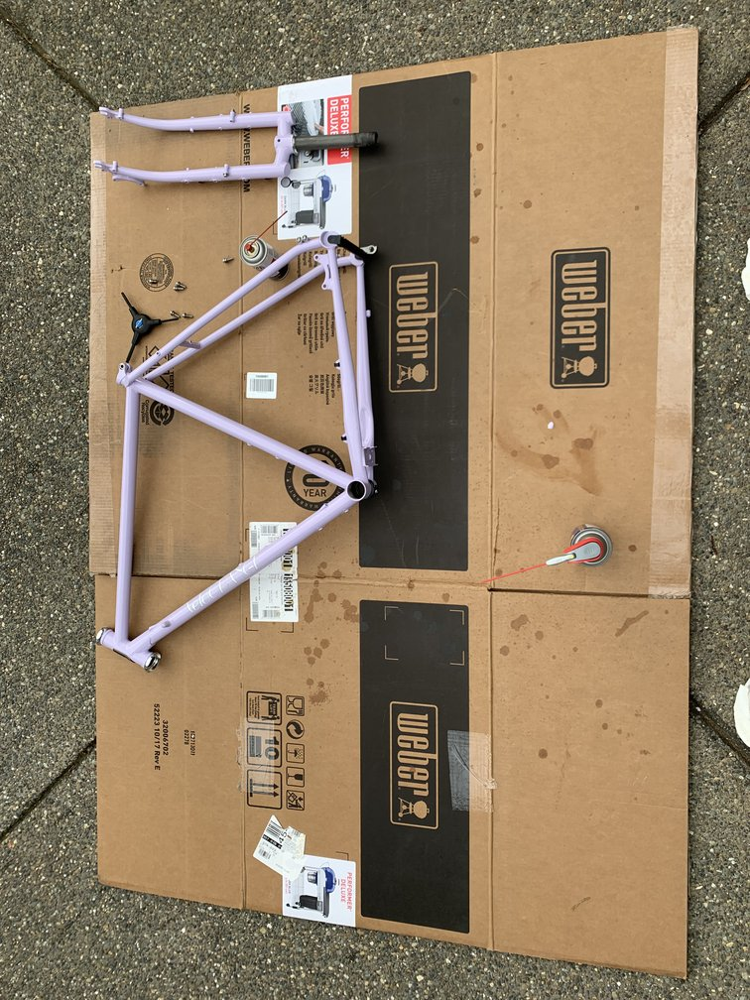

I'm building my own bike from parts! Not the actual frame, as some
people thought. Also, I didn't build the wheels this time. Jim at Gladys Bikes
built them which I am super happy how they turned out. Thanks Jim!

I made several trips to Universal Cycles to pick up parts. I tried to do it all
by bike.

I learned a lot throughout this process, like how to install a headset using a
headset press (thanks Kenton Cycles!):

What was funny about this was at the time I did not have a car accessible to
me. So I biked my frame up to the bike shop.

I was told that I should use some frame saver to prevent rust. The guy at
Kenton cycles was nice enough to let me borrow a can since a little bit goes a
long way. 

I didn't take too many photos of the build process, but here's how it turned
out!

