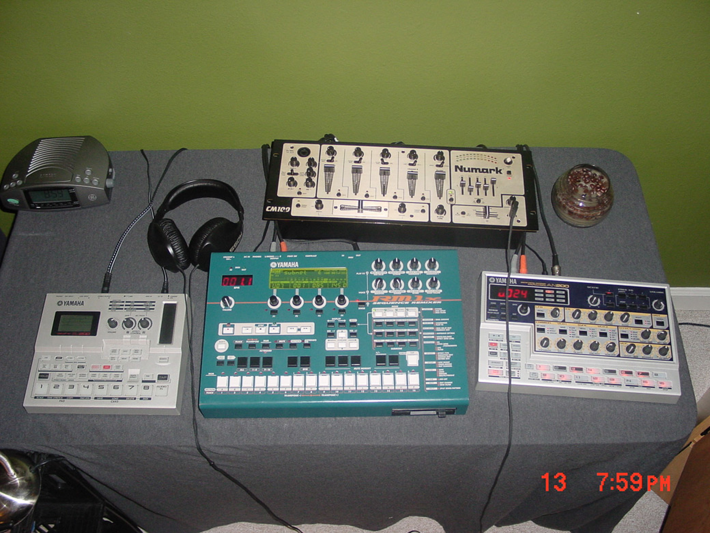

import AudioPlayer from "../../../components/AudioPlayer.astro";
import audio from "./deep_strata_-_masala.mp3";

I chose Masala today because it's a track that I remember very little about, but
it's a special song.

### Backstory

This was my setup at the time. The Yamaha SU-200 was a pain in the ass to work
with, but it provided me with some sampling capabilities alongside my RM1x. The
reason this song is so special to me is because I think it was kind of a gloomy,
rainy day outside (perfect for making music), and this track just came together
like magic. I remember being so surprised. And it is a 9 minute track that
doesn't feel that repetitive or boring. It's one of the few tracks I made where
it felt effortless and it turned out great.

Recorded under my Deep Strata moniker.

<AudioPlayer src={audio} />
